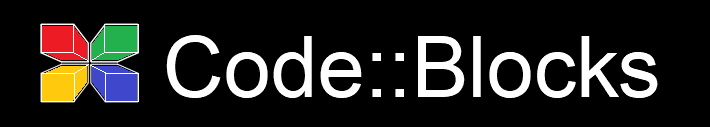
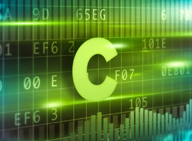

# Основы программирования на языке Си (часть 2).

### В этом проекте рассмотрены: 
- Строки и их обработка.
- Указатели. Понятие. Виды. 
- Структуры. Массивы структур. Вложенные структуры. Выравнивание структур. 
- Продолжение темы "Функции". Возврат многих значений. Передача массива и структуры в функцию.  
  Функции Win32 API.
- Динамическое выделение памяти. 

### Файлы: 
1. Работа с указателем;
2. Массив-указатель;

(<a href="#readme-top">back to top</a>)

